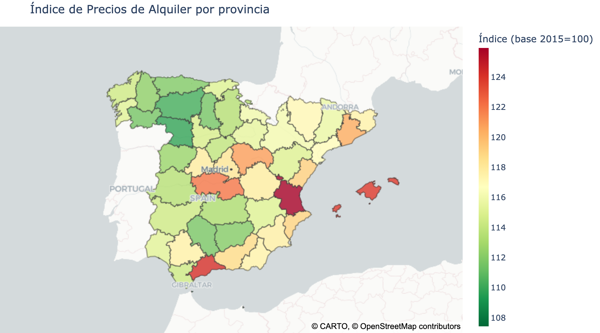

# Índice de Precios de Alquiler

> Índice de precios de alquiler por provincia (trimestral)
> Último dato: diciembre 2022

## Mapa por provincia

## Estadísticas resumen

| Métrica | Valor |
|---------|-------|
| Media | 115.9 |
| Mediana | 115.4 |
| Máximo | 125.9 |
| Mínimo | 107.4 |
| Provincias | 48 |

## Top 5 provincias

| Provincia | Índice (base 2015=100) |
|-----------|--------|
| València/Valencia | 125.9 |
| Málaga | 124.2 |
| Illes Balears | 123.9 |
| Toledo | 122.0 |
| Santa Cruz De Tenerife | 121.6 |

## Bottom 5 provincias

| Provincia | Índice (base 2015=100) |
|-----------|--------|
| Melilla | 107.4 |
| Ceuta | 108.5 |
| Zamora | 109.9 |
| León | 110.3 |
| Ourense | 111.6 |

## Ranking completo

## Evolución temporal (top 10 provincias)

## Datos

Los datos completos están disponibles en:
- `data/csv/alquiler_ultimo.csv` — último dato por provincia
- `data/csv/alquiler_serie.csv` — serie temporal completa
